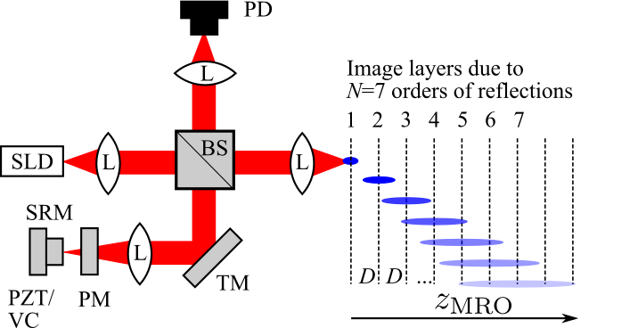
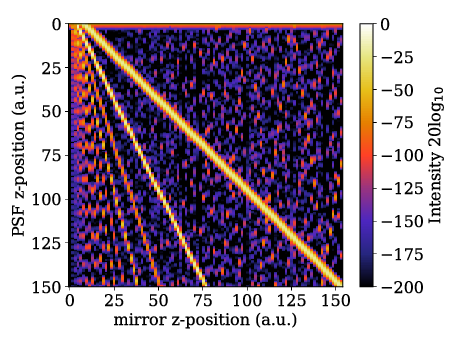

# mr-oct-simulation
Multiple reference optical coherence tomography simulation

Related to 

K. Neuhaus, “The multi-spectral signal properties of multiple reference optical coherence tomography,” PhD Thesis, NUI Galway, 2019.
[http://hdl.handle.net/10379/15318](https://aran.library.nuigalway.ie/handle/10379/15318)
